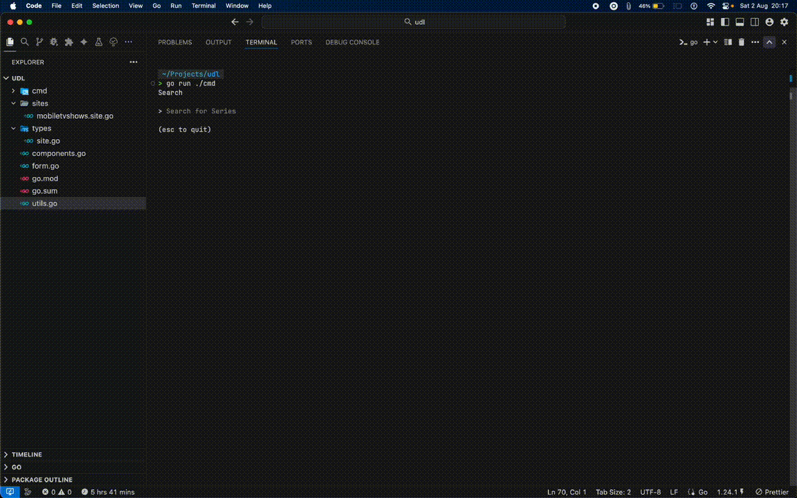

# **Universal Downloader** 📺



## Overview
Universal Downloader is a command-line utility built in Go that empowers users to effortlessly search, select, and download TV show episodes from various online sources. It leverages robust web scraping techniques and provides an intuitive, interactive terminal user interface (TUI) for a seamless experience.

## Features
*   **Interactive TUI:** Navigate and make selections directly within your terminal using `Bubble Tea`.
*   **Web Scraping:** Efficiently parse and extract content links from specific TV show websites with `Colly`.
*   **Download Progress Bar:** Monitor download progress in real-time with a visually appealing TUI progress bar.
*   **Modular Site Support:** Designed with extensibility to easily integrate new video streaming sites.
*   **Lightweight & Fast:** Built with Go for high performance and minimal resource usage.

## Getting Started

To get started with Universal Downloader, follow these steps:

### Installation

1.  **Clone the Repository**:
    ```bash
    git clone https://github.com/struckchure/udl.git
    ```
2.  **Navigate to the Project Directory**:
    ```bash
    cd udl
    ```
3.  **Run Directly (for quick testing)**:
    ```bash
    go run cmd/main.go
    ```
    This command will download and run all necessary Go modules automatically.
4.  **Build and Run (for a standalone executable)**:
    To create a compiled executable, use:
    ```bash
    go build -o udl cmd/main.go
    ```
    You can then run the executable from anywhere in your terminal:
    ```bash
    ./udl
    ```

## Usage

Universal Downloader provides an interactive experience directly in your terminal. Follow the prompts to search, select, and download content.

1.  **Start the Application**:
    Execute the compiled binary or run the `main.go` file:
    ```bash
    ./udl
    # or
    go run cmd/main.go
    ```
2.  **Search for a Series**:
    The application will present an input prompt titled "Search for Series". Type the name of the TV show you want to find (e.g., "tom and jerry") and press `Enter`.
3.  **Select a Series**:
    After your search, a list of matching series will appear. Use the `Up` and `Down` arrow keys to navigate the list and press `Enter` to select the desired series.
4.  **Select a Season**:
    Once a series is selected, a new list will display all available seasons for that series. Again, use `Up`/`Down` and `Enter` to choose a season.
5.  **Select an Episode**:
    Finally, you will see a list of episodes for the chosen season. Select the episode you wish to download using the arrow keys and pressing `Enter`.
6.  **Download Progress**:
    The application will then initiate the download. A progress bar will appear, showing the download status.
7.  **Download Completion**:
    Upon successful completion, a "Download complete" message will be displayed, indicating the file path where the episode was saved.

*   **Exit at any time**: You can exit the interactive prompts by pressing `Ctrl+C` or `Esc`.

## Technologies Used

| Technology                                                 | Description                                            |
| :--------------------------------------------------------- | :----------------------------------------------------- |
| [Go](https://golang.org/)                                  | Primary programming language for high performance.     |
| [Charmbracelet Bubble Tea](https://github.com/charmbracelet/bubbletea) | A powerful framework for building interactive TUIs.    |
| [Charmbracelet Bubbles](https://github.com/charmbracelet/bubbles)     | TUI components (text input, lists, progress bars).     |
| [Charmbracelet Lipgloss](https://github.com/charmbracelet/lipgloss)   | Styling library for beautiful terminal layouts.        |
| [Colly](https://github.com/gocolly/colly)                  | Fast and elegant web scraping framework for Go.        |
| [Samber Lo](https://github.com/samber/lo)                  | A toolkit of utility functions for Go.                 |

## Contributing

Contributions are welcome! If you'd like to contribute to Universal Downloader, please follow these guidelines:

*   ✨ **Fork the repository.**
*   🌱 **Create a new branch** for your feature or bug fix: `git checkout -b feature/your-feature-name`.
*   💻 **Make your changes** and ensure the code adheres to Go best practices.
*   🧪 **Write tests** for your changes, if applicable.
*   ⬆️ **Commit your changes** with a clear and concise message.
*   🚀 **Push your branch** to your forked repository.
*   📬 **Open a pull request** to the `main` branch of this repository.

## License

This project does not currently have an explicit license file.

## Author Info

*   **Struckchure**
    *   Twitter: [https://twitter.com/struckchure](https://twitter.com/struckchure)
    *   LinkedIn: [https://www.linkedin.com/in/struckchure](https://www.linkedin.com/in/struckchure)

---

[](https://github.com/struckchure/udl/actions/workflows/go.yml)
[](https://go.dev/)
[](https://choosealicense.com/no-permission/)
[](https://www.npmjs.com/package/dokugen)
